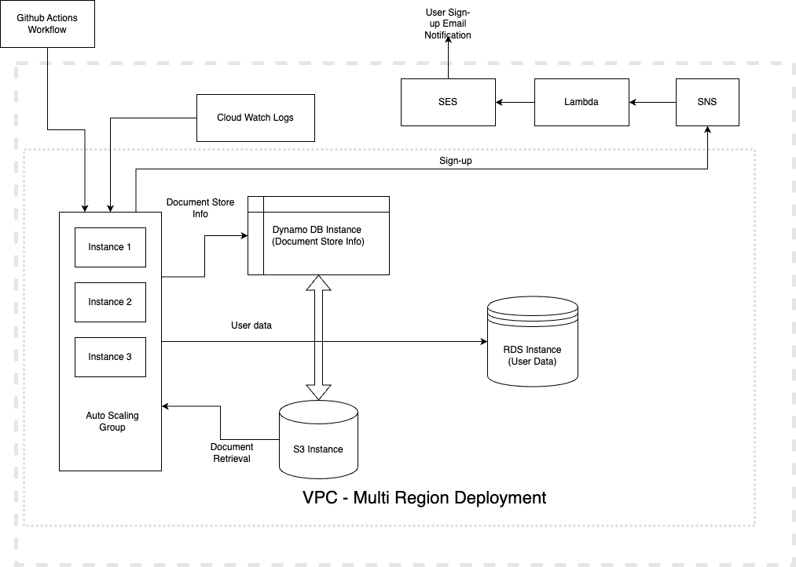

## Pre-requisites:
- AWS Account
- AWS SDK installed in the local machine
- node (LTS)
        
### To Run application:
- Fork the current repository
- git clone https://github.com/ashwinbalajidhandapani/infrastructure.git
- Make changes to cloudformation template wherever necessary (config.json)
- run the cloudformation template - default AZ - us-east-1 (us-east-2 and us-west-1 also available)

### Architecture

### User Stories Implemented
1. All API request/response payloads should be in JSON.
2. No UI should be implemented for the application.
3. As a user, I expect all API calls to return with a proper HTTP status code (Links to an external site.).
4. As a user, I expect the code quality of the application is maintained to the highest standards using the unit and/or integration tests.
5. Your web application must only support Token-Based authentication, not Session Authentication (Links to an external site.).
6. As a user, I must provide a basic (Links to an external site.) authentication (Links to an external site.) token when making an API call to the authenticated endpoint.
7. Create a new user
8. As a user, I want to create an account by providing the following information.
    - Email Address
    - Password
    - First Name
    - Last Name
10. account_created field for the user should be set to the current time when user creation is successful.
9. User should not be able to set values for account_created and account_updated. Any value provided for these fields must be ignored.
11. The password field should never be returned in the response payload.
12. As a user, I expect to use my email address as my username.
13. The application must return a 400 Bad Request HTTP response code when a user account with the email address already exists.
14. As a user, I expect my password to be stored securely using the BCrypt password hashing scheme (Links to an external site.) with salt (Links to an external site.).
15. Update user information
16. As a user, I want to update my account information. I should only be allowed to update the following fields.
    - First Name
    - Last Name
    - Password
17. Attempt to update any other field should return 400 Bad Request HTTP response code.
18. account_updated field for the user should be updated when the user update is successful.
19. A user can only update their own account information.
20. Get user information, As a user, I want to get my account information. Response payload should return all fields for the user except for the password.

    
